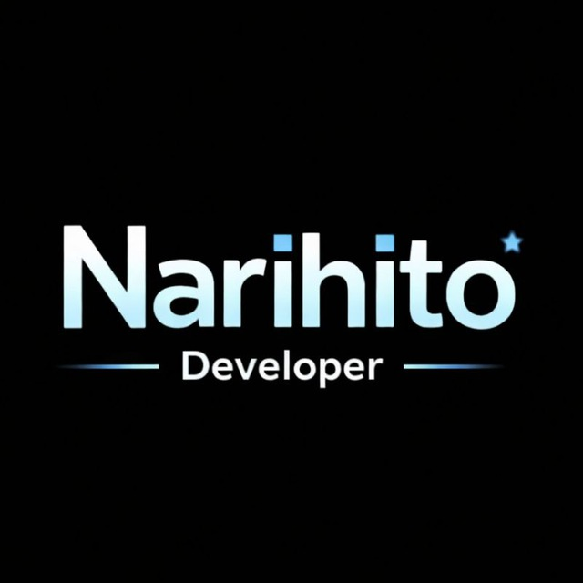

<p align="center">
  
</p>

<h1 align="center">Narihito — Portfolio</h1>

<p align="center">
  A full-stack, motion-rich portfolio site built with Next.js, TypeScript, Tailwind CSS, and GSAP.
</p>

## Getting Started

```bash
npm install
npm run dev
```

Open [http://localhost:3000](http://localhost:3000) to see the result.

## Tech Stack

- [Next.js](https://nextjs.org) (App Router)
- TypeScript
- Tailwind CSS
- [GSAP](https://gsap.com) — scroll-triggered and cursor-driven motion
- [Three.js](https://threejs.org) — hero WebGL scene
- [Lenis](https://lenis.darkroom.engineering) — smooth scroll

## Project Structure

Feature-based structure under `src/features/`, with shared UI, hooks, and utilities in `src/shared/`. Each feature owns its own `components/`, `types/`, and `data/`.

## Scripts

```bash
npm run dev      # start dev server
npm run build    # production build
npm run lint     # run eslint
```
